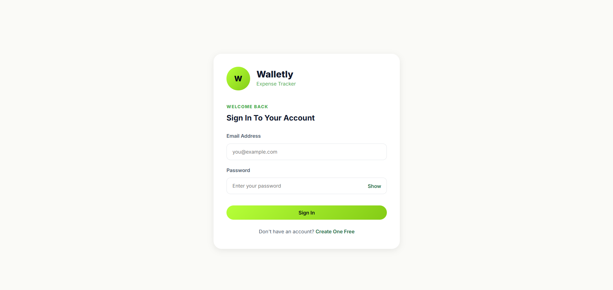
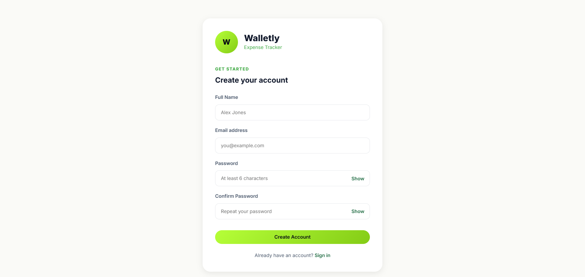
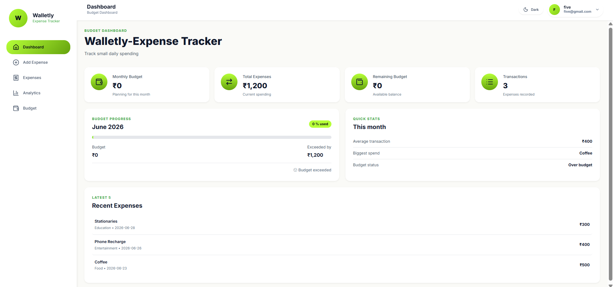
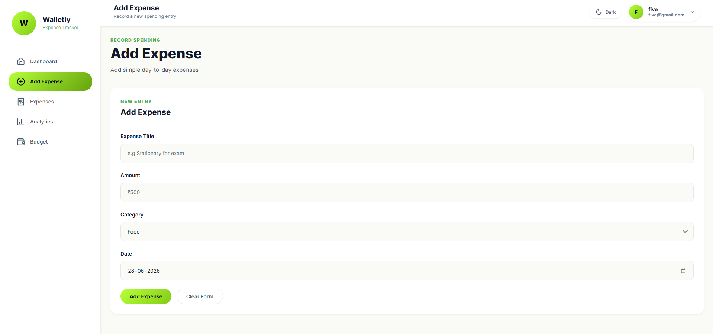
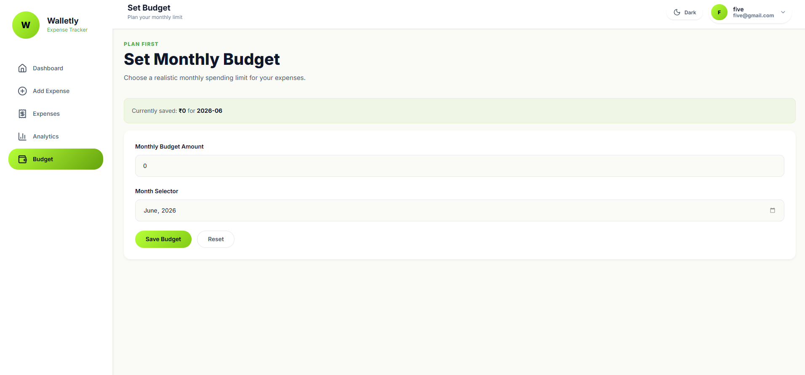
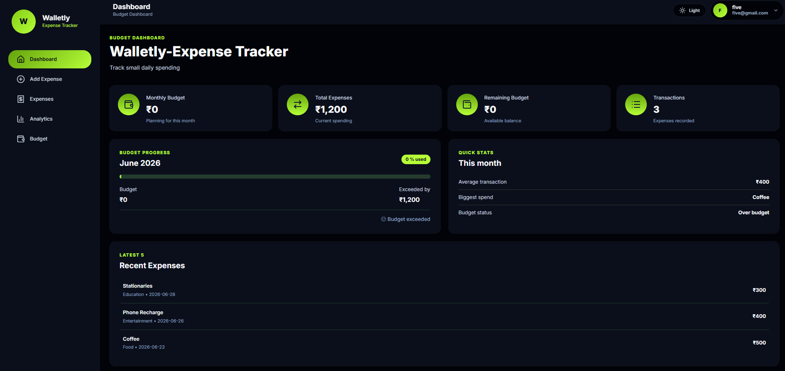

# Walletly

Walletly is a full-stack personal finance management web application built using the MERN stack. It helps users manage expenses, track income, monitor transactions, and maintain better control over their finances through a simple and efficient interface.

## Features

* Add and manage income sources
* Track daily expenses
* Analyze your expenses through analytics page
* Categorize transactions
* Budget management system
* Transaction history with filters
* Dashboard for financial overview
* Secure user authentication
* Responsive design for all devices

---

## Tech Stack

### Frontend

* React.js
* CSS
* Axios
* React Router

### Backend

* Node.js
* Express.js

### Database

* MongoDB
* Mongoose

### Authentication

* JWT (JSON Web Token)
* bcrypt.js

---

## Installation

Clone the repository

```bash
git clone https://github.com/Ryanman9/Walletly.git
```

Move to project folder

```bash
cd walletly
```

Install dependencies for backend

```bash
cd server
npm install
```

Install dependencies for frontend

```bash
cd client
npm install
```

Run backend server

```bash
npm run dev
```

Run frontend

```bash
npm run dev
```

---

## Environment Variables

Create a `.env` file inside the server folder

```env
PORT=5000
MONGO_URI
JWT_SECRET
```

---

## Future Improvements

* Monthly financial reports
* Export data as PDF or CSV
* Multi currency support
* Bank account integration

---

## Screenshots

### Login Page


### Register Page


### Dashboard


### Add Expense


### Set Budget


### Dark Mode


---

## License

MIT License

---

## Author

Developed by **Asfar Khan**

---

## Vision

Walletly is designed to simplify money management and help users build smarter financial habits using modern web technologies.
